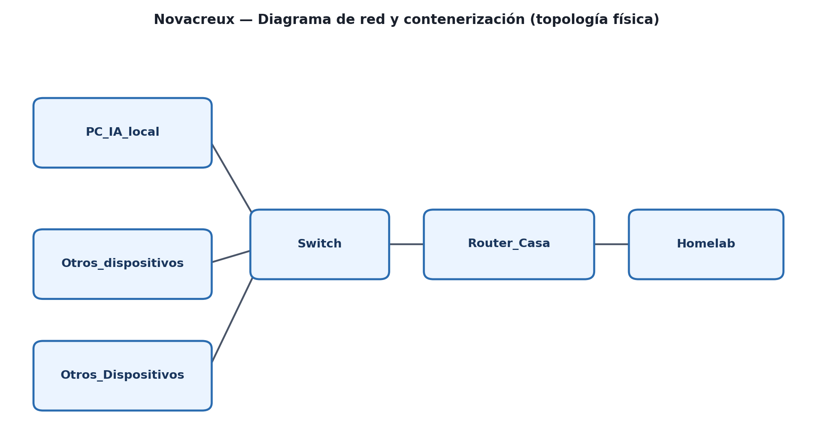

<div align="center">

# Novacreux — Homelab & Edge AI

**Ecosistema autohospedado de IA, homelab y Edge AI**, desplegado y
documentado íntegramente en local: monitorización, DNS, VPN, seguridad
perimetral y varios stacks de IA generativa ejecutados sobre cuatro tipos de
hardware distintos (GPU de consumo NVIDIA 4060ti 16gb, Raspberry Pi + NPU, NVIDIA Spark y
NVIDIA Jetson Orin Nano).

[](./LICENSE)


</div>

---

## Índice

- [Sobre el proyecto](#sobre-el-proyecto)
- [Arquitectura](#arquitectura)
- [Estructura del repositorio](#estructura-del-repositorio)
- [Stack de tecnologías](#stack-de-tecnologías)
- [Homelab — servicios](#homelab--servicios)
- [IA en local (PC con GPU)](#ia-en-local-pc-con-gpu)
- [Edge AI (Raspberry Pi, Jetson, Spark)](#edge-ai-raspberry-pi-jetson-spark)
- [Quickstart](#quickstart)
- [Documentación completa (TFG)](#documentación-completa-tfg)
- [Autores](#autores)
- [Licencia](#licencia)

---

## Sobre el proyecto

**Novacreux** es un ecosistema tecnológico pensado para explorar, de forma
100% local y privada, las distintas capas necesarias para llevar IA
generativa a producción: desde la infraestructura base de un homelab
(DNS, monitorización, seguridad, automatización) hasta la ejecución de
modelos de lenguaje e IA de visión sobre distintos tipos de hardware,
comparando rendimiento, consumo y coste entre ellos.

El proyecto está dividido en varios bloques:

| Bloque | Qué resuelve |
|---|---|
| **Homelab** | Infraestructura base: DNS propio, galería de fotos privada, monitorización, prevención de intrusiones y automatización — todo en contenedores Docker. |
| **IA en local (PC)** | Un LLM completo corriendo en una GPU de consumo (RTX 4060 Ti), con interfaz web (OpenWebUI) y API expuesta a la red interna. |
| **Edge AI (Raspberry Pi)** | Un modelo de visión artificial sobre un chip NPU de bajo consumo, capaz de describir escenas de vídeo en tiempo real. |
| **NVIDIA Spark / Jetson Orin Nano** | Exploración de hardware de gama alta para entrenamiento/inferencia de modelos grandes y robótica/Edge AI en tiempo real. |

Cada bloque es perfectamente extrapolable a un entorno empresarial: evita
pérdidas humanas o materiales, mejora la seguridad actuando de forma
proactiva (incluso autónoma) e incrementa la independencia tecnológica sin
depender de servicios externos de pago.

## Arquitectura



Topología física simplificada: los dispositivos de la red doméstica
(incluyendo el PC de IA local) se conectan a través de un switch al router,
que a su vez da salida al servidor homelab (24/7), accesible de forma segura
desde cualquier lugar mediante VPN (Tailscale).

## Estructura del repositorio

```
Novacreux-Homelab-EdgeAI/
│
├── README.md                  # Este documento
├── LICENSE                    # Licencia MIT
├── .gitignore
│
├── docs/
│   ├── Novacreux_TFG.pdf       # Memoria completa del proyecto (121 págs.)
│   └── network_diagram.png     # Diagrama de red físico
│
├── homelab/                    # Todo lo desplegado en el servidor Ubuntu
│   ├── docker-compose/
│   │   ├── docker-compose_immich.yml
│   │   ├── docker-compose_netdata.yml
│   │   ├── docker-compose_pihole.yml
│   │   ├── docker-compose_uptime-kuma.yml
│   │   └── docker-compose_n8n.yml
│   ├── configs/
│   │   ├── fail2ban_jail.local
│   │   └── tailscale_setup.md
│   └── setup_server.sh         # Script opcional de bootstrap
│
├── local-llm/                  # IA en el PC con GPU (NVIDIA 4060 Ti)
│   ├── README.md
│   ├── ollama_service_config.md
│   └── glances_monitoring.md
│
└── edge-ai/                    # Raspberry Pi, Jetson, Spark
    ├── python-video-analysis/
    │   ├── analyze_video.py
    │   ├── requirements.txt
    │   └── README.md
    ├── raspberry-pi-setup/
    │   └── README.md
    └── hardware-benchmarks/
        └── comparison_table.md
```

## Stack de tecnologías

**Infraestructura / Homelab**
`Ubuntu Server` · `Docker` / `Docker Compose` · `Tailscale (VPN)` · `Pi-hole (DNS)` · `Fail2ban (IPS)` · `Uptime Kuma` · `Netdata` · `n8n`

**IA / LLM**
`Ollama` · `Open WebUI` · `Qwen3-VL` · `Mistral Nemo` · `ComfyUI` · `RAG (Qdrant)`

**Edge AI**
`Raspberry Pi 5` · `Hailo-10H NPU (AI HAT+ 2)` · `OpenCV` · `Python` · `OpenClaw`

**Hardware evaluado**
`NVIDIA RTX 4060 Ti 16GB` · `NVIDIA Spark` · `NVIDIA Jetson Orin Nano`

## Homelab — servicios

Servidor Ubuntu Server (sin GUI) con los siguientes servicios en contenedores
Docker independientes — cada uno con su propio `docker-compose.yml` en
[`/homelab/docker-compose`](./homelab/docker-compose):

| Servicio | Función | Puerto |
|---|---|---|
| **Pi-hole** | DNS propio + bloqueo de publicidad/tracking a nivel de red | 53 (DNS), 80 (web) |
| **Immich** | Galería de fotos/vídeos autohospedada (alternativa a Google Fotos) | 2283 |
| **Uptime Kuma** | Monitorización de disponibilidad de servicios (HTTP/TCP/ping/DNS) | 3001 |
| **Netdata** | Monitorización de infraestructura en tiempo real (CPU, RAM, red, disco) | 19999 |
| **n8n** | Automatización de workflows (orquesta los distintos servicios de IA) | 5678 |
| **Fail2ban** | Sistema de prevención de intrusiones (bloqueo automático de IPs tras fuerza bruta SSH) | — |
| **Tailscale** | VPN mesh para acceso remoto seguro sin exponer puertos a internet | — |

> Sustituye `[IP_SERVER]` en cada `docker-compose.yml` por la IP real de tu
> servidor.

Bootstrap opcional de todo el servidor: [`homelab/setup_server.sh`](./homelab/setup_server.sh).

## IA en local (PC)

Stack de IA generativa 100% privado sobre un PC con GPU dedicada
(NVIDIA RTX 4060 Ti 16GB): backend con **Ollama**, interfaz **Open WebUI**,
exposición controlada del servicio a la red interna, y monitorización de GPU
en tiempo real con **Glances**.

📄 Documentación completa: [`/local-llm/README.md`](./local-llm/README.md)

## Edge AI (Raspberry Pi, Jetson, Spark)

Una **Raspberry Pi 5 + AI HAT+ 2** (chip Hailo-10H, 40 TOPS) ejecuta un
script en Python que extrae fotogramas de vídeo y consulta a un modelo de
visión (**Qwen3-VL**) qué está ocurriendo en la escena — base para casos de
uso como detección de riesgos laborales o eventos de seguridad sin
intervención humana.

- Setup completo: [`/edge-ai/raspberry-pi-setup/README.md`](./edge-ai/raspberry-pi-setup/README.md)
- Script de análisis de vídeo: [`/edge-ai/python-video-analysis/`](./edge-ai/python-video-analysis/)
- Comparativa de hardware (4060 Ti / Raspberry Pi / Spark / Jetson Orin Nano), incluyendo consumo energético y tokens/segundo: [`/edge-ai/hardware-benchmarks/comparison_table.md`](./edge-ai/hardware-benchmarks/comparison_table.md)

## Quickstart

```bash
git clone https://github.com/Izan1706/Novacreux-Homelab-EdgeAI.git
cd Novacreux-Homelab-EdgeAI

# 1. Levantar un servicio del homelab (ejemplo: Pi-hole)
cd homelab/docker-compose
# edita docker-compose_pihole.yml: cambia WEBPASSWORD y [IP_SERVER]
sudo docker compose -f docker-compose_pihole.yml up -d

# 2. Desplegar IA local en un PC con GPU NVIDIA
cd ../../local-llm
# sigue los pasos de README.md (instalación de Ollama + Open WebUI)

# 3. Analizador de vídeo con IA en Raspberry Pi
cd ../edge-ai/python-video-analysis
python3 -m venv venv && source venv/bin/activate
pip install -r requirements.txt
python3 analyze_video.py
```

## Documentación completa (TFG)

Este repositorio es una extracción práctica, lista para reutilizar, del
Proyecto Final de ASIX **"Novacreux"**. La memoria completa del proyecto
(121 páginas, con capturas de pantalla paso a paso de cada despliegue) está
disponible en [`/docs/Novacreux_TFG.pdf`](./docs/Novacreux_TFG.pdf).

Más contexto y proyectos relacionados en el portfolio personal:
**[izan1706.github.io](https://izan1706.github.io)**

## Autores

- **Izan Rodríguez García** — [GitHub](https://github.com/Izan1706) · [Portfolio](https://izan1706.github.io)
- **Oscar Toledo Fernandez** - Compañero de proyecto

Proyecto Final de Grado — FP ASIX (Administración de Sistemas Informáticos en Red).

## Licencia

Distribuido bajo licencia MIT. Ver [`LICENSE`](./LICENSE) para más detalles.
